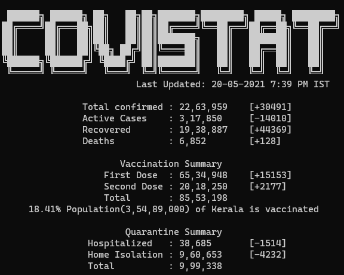

# Covistat
## Covid-19 stats summary for Kerala in your terminal

    

Covistat is a terminal app that displays Covid-19 statistics for Kerala, fetching and displaying from public [API](https://keralastats.coronasafe.live/)s by Coronasafe.
- It uses goroutines for concurrent fetch and unmarshalling of response from sources.
- Stats updates usually take place every 24 hours.

## Installation
Install the latest version in `$GOBIN` or `$GOROOT\bin` by

    go get github.com/viswa/covistat@latest

Or download the appropriate binary from [releases](https://github.com/viswa/covistat/releases/)
## Usage

    covistat

## License
Covistat is licensed under [MIT License](https://github.com/viswa/covistat/blob/master/LICENSE).